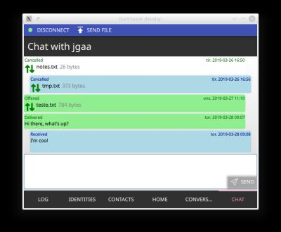
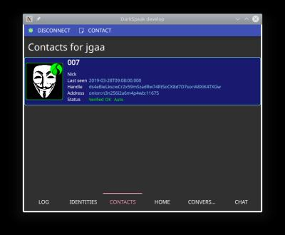

# DarkSpeak

Secure Peer to Peer Instant Messenger, using the Tor network for anonymity and best practice cryptorafic measures to provide privacy and authenticity.

Screenshots

 

# Mission Statement

To make a Secure and Private Communication Platform for people.

# Secure and anonymous

All communication is encrypted using Public Key Cryptography (PKS) at the endpoints. Not even the Tor proxy-servers sees the content of any message or even the signaling. There are no central servers and no company-run services. That mean's that there are no-one to subpoena to get even the metadata regarding any conversation. The only traces left of any communications are the TCP connections in the Tor network.

Each peer run it's own Tor Hidden Service. This means that DarkSpeak will work as long as Tor works at any given time or place in the world. If a government feels threatened by Free Speech (and it seems like most of them do), there is still no way they can shut you down. There are no domain-names to block or take over and no IP addresses to block. If Tor works, you are free to talk with whoever you want.

# History

This project began in April 2016, when I wanted to chat with my friends without Facebook, Google, NSA or anyone else overseeing our conversations. The idea that private conversations are no longer possible, and that we just have to accept that, provokes me. So I used the, now dead, "Tor Chat" project as a starting-point for a protocol, and wrote my own client in C++, using QT and QML for GUI.

However, because the legacy Tor Chat client was bundling an obsolete Tor server, my program was unable to maintain reliable connections with actual "Tor Chat" users. So at some point I decided to learn from my experience with the original implementation and write a new one from scratch.

The [original implementation](https://github.com/jgaa/darkspeak/tree/original-impl-torchat-prot) is still available.

# Current status

**Implementing**

- [x] Builds on Linux (Ubuntu LTS)
- [x] Builds on macos
- [ ] Builds on Windows 10 (MSVC)
- [x] Send and receive messages
- [x] Send and receive files
- [x] Multiple, independent Identities
- [ ] Automated builds (Jenkins)
- [ ] Automated tests
- [x] Use an external Tor server
- [ ] Use an embedded Tor server
- [x] Legacy onion addresses
- [ ] New onion addresses
- [ ] Encrypt private keys and require password to use them
- [ ] Encrypt messages locally and require password to read them

Working towards a public Beta release for Desktop in April 2019.

# Planned post-beta features

- [ ] Android version (Spring 2019)
- [ ] IOS version (Spring 2019)
- [ ] Group Chat (Summer 2019)
- [ ] Multiple device support (Like Skype - you have DarkSpeak on your laptop, phone and tablet, and people can reach you on any one of them, while the messsage-history are available on all of them) (Fall 2019).
- [ ] Built in File Server (like running your own FTP server, just much more secure) (2020)
- [ ] Feeds (like RSS subscriptions, but designed to be used for anything from Twitter-like short messages, to publishing newsletters).

# Links to related and relevant projects
 - [Ricochet, anonymous peer-to-peer instant messaging](https://github.com/ricochet-im/ricochet)
 - [saltpack, a modern crypto messaging format](https://saltpack.org/)

